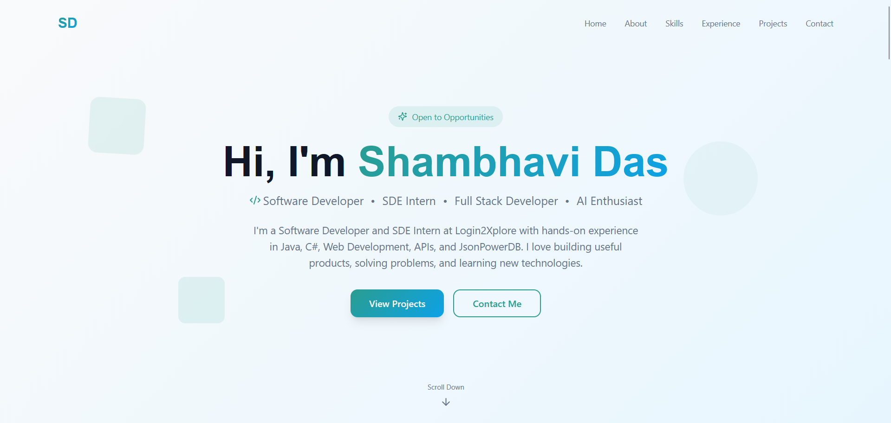
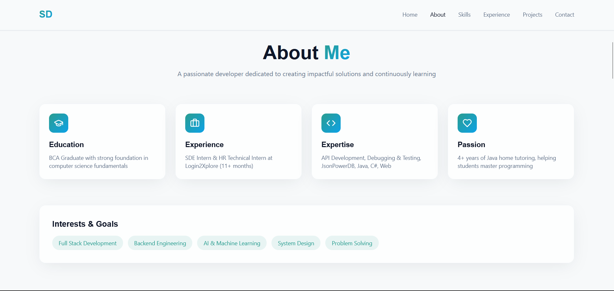
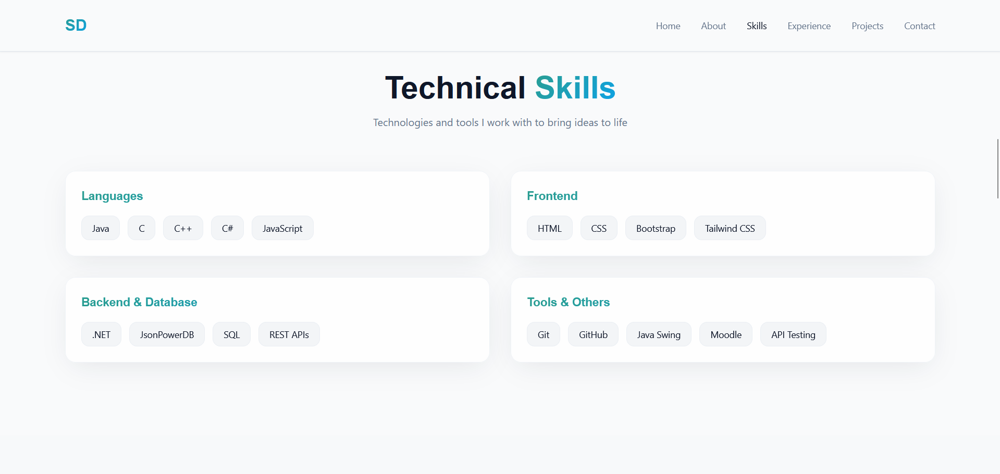
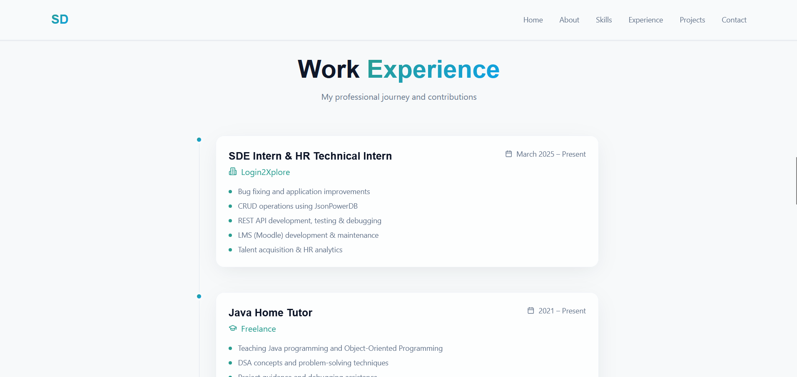
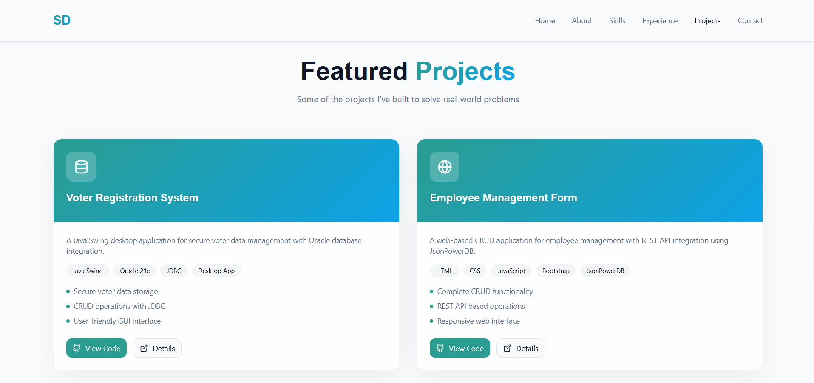
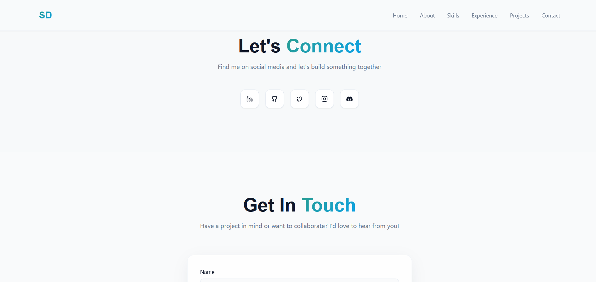
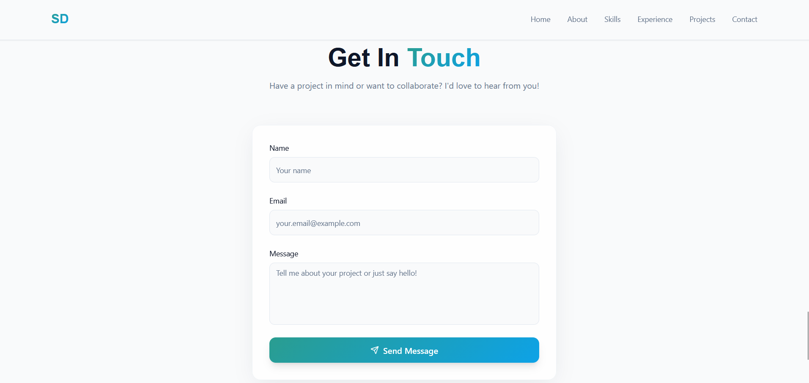

# 🌐 Shambhavi Das — Developer Portfolio

🚀 **Live Website:**  
👉 https://shambhavidas-portfolio.lovable.app

A **modern, animated, and tech-forward personal portfolio website** built to showcase my skills, experience, and projects as a **Software Developer & SDE Intern**.

---

## 📚 Table of Contents

- [Project Overview](#-project-overview)
- [Core Sections](#-core-sections)
- [Screenshots](#-screenshots)
- [Featured Projects](#-featured-projects)
- [Tech-Stack](#-tech-stack)
- [Security & Reliability](#-security--reliability)

---

## 🧠 Project Overview

This is a personal portfolio website for **Shambhavi Das**, built using **React, Tailwind CSS, and Framer Motion** with a clean **teal/cyan glass-morphism design system**.

It showcases my journey from a **Java Tutor** to a **Full-Stack Developer** with interests in **AI, Backend Engineering, and System Design**.

---

## 🧩 Core Sections

- 🏠 **Hero** – Animated introduction with role tags and CTAs  
- 👩‍💻 **About** – BCA Graduate, Login2Xplore Intern, 4+ years Java tutoring experience  
- 🛠️ **Skills** – Java, C#, .NET, JsonPowerDB, Web Development, and more  
- 💼 **Experience** – Timeline-based work experience with animated cards  
- 🚀 **Projects** – Featured projects with GitHub links  
- 🔗 **Social Links** – LinkedIn, GitHub, X, Instagram, Discord  
- 📬 **Contact** – Secure contact form that sends emails via backend  

---

## 📸 Screenshots

> A quick look at the portfolio design, layout, and UI.

### 🏠 Home / Hero Section

### 👩‍💻 About & Skills Section

### 💼 Experience Section

### 🚀 Projects Section

### 🤝 Social Media Connectivity

### 📬 Contact Section

---

## 🚀 Featured Projects

### 1️⃣ Voter Registration System
- Java Swing Desktop Application  
- Oracle 21c + JDBC  
- Secure voter data storage  
🔗 GitHub: https://github.com/shambhavii12/CollegeProject

### 2️⃣ Employee Management Form
- Web-based CRUD Application  
- HTML, CSS, JavaScript, Bootstrap, JsonPowerDB  
🔗 GitHub: https://github.com/shambhavii12/EmployeeForm

---

## 🛠️ Tech-Stack

### Frontend
- ⚛️ React + Vite  
- 🎨 Tailwind CSS (Teal/Cyan Glass-morphism theme)  
- 🎞️ Framer Motion (Animations)  

### Backend (Contact Form)
- ☁️ Lovable Cloud (Supabase)  
- 📩 Resend API (Email delivery)  
- 🧩 Supabase Edge Functions  

---

## 🔐 Security & Reliability

The contact form backend includes:

- ✅ Server-side input validation  
- ✅ HTML sanitization  
- ✅ IP-based rate limiting (5 requests/hour)  
- ✅ Secure API key handling  
- ✅ No client-side email exposure  

> ℹ️ No database tables exist yet. When added, **RLS policies** will be enabled.

---

